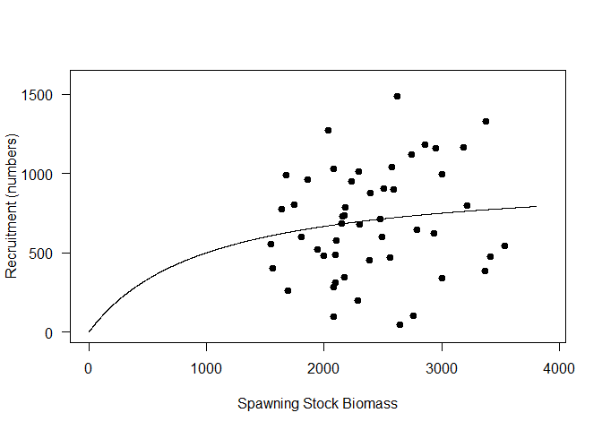
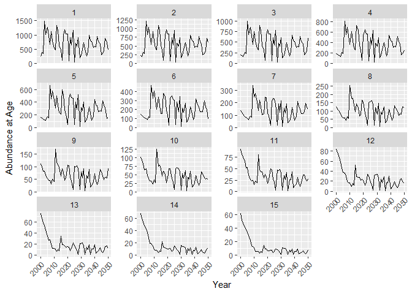
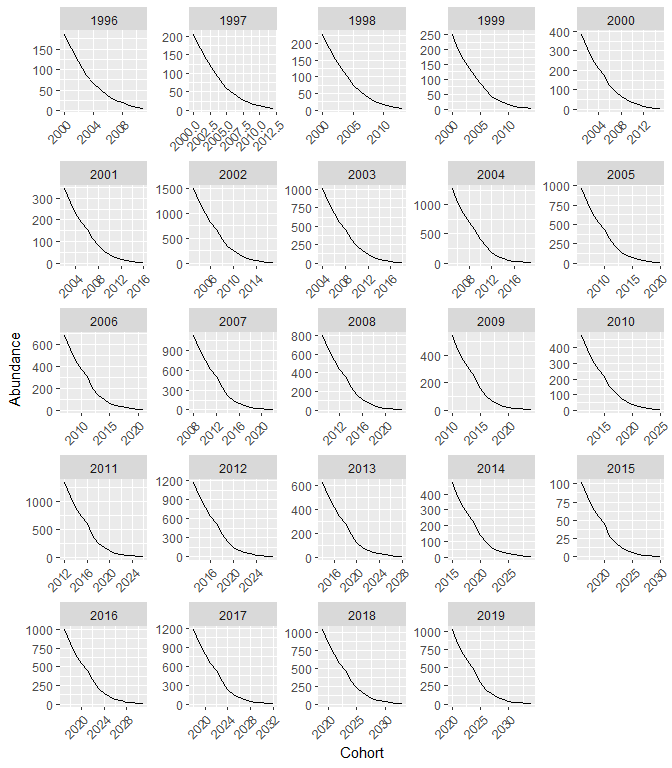
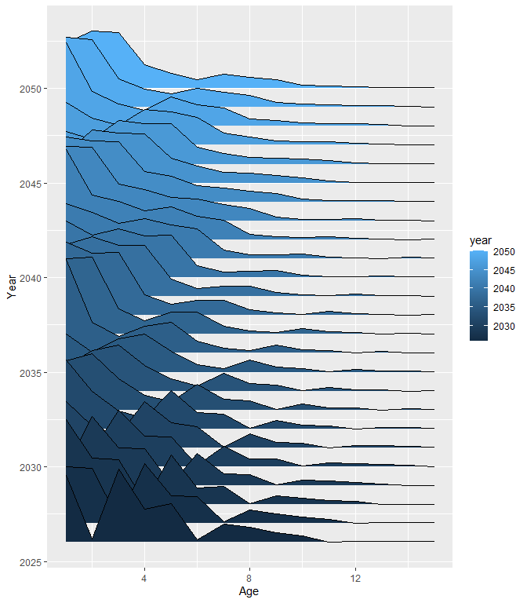

Age Structured Model Simulation
================
Matt Robertson
March 2025

# Data Setup

I am going to make a ficticious fish population and track its dynamics
in response to an increasing and then stabilzing amount of fishing
pressure.

To do this, we first need to define the time over which we want to track
this population’s dynamics as well as some basic components of this
population’s biology.

I am going to run a simulation for 50 years, lets say from 2000 to 2050.

``` r
yrs<-seq(from=2000, to=2050)
nyears<-length(yrs)
```

This species is going to grow to 15 years old and have an $L_{inf}$ of
100 cm. You can modify these values if you’d like. However, this
simulation relies on some very specific assumptions and any changes you
make could lead to a rapid population decline or increase.

``` r
nages<-15
linf<-100
laa<-rep(NA, nages)
for(i in 1:15){
laa[i]<-linf*(1-exp(-0.25*(i-0.01)))
}

plot(laa~seq(from=1, to=nages, by=1), pch=19, xlab="Age", ylab="Mean Length (cm)", las=1)
lines(laa~seq(from=1, to=nages, by=1))
```

<!-- -->

This species is going to grow cubically, i.e., $b=3$ in the
length-weight equation.

``` r
waa<-rep(NA, nages)
b<-3
for(i in 1:15){
  waa[i]<-(0.001*laa[i]^b)/100
  }

par(mfrow=c(2,1))
plot(waa~laa, pch=19, xlab="Mean Length (cm)", ylab="Mean Weight (kg)", las=1, xlim=c(30,max(laa)+10), ylim=c(0,max(waa)+1))
lines(waa~laa)
plot(waa~seq(from=1, to=nages, by=1), pch=19, xlab="Age", ylab="Mean Weight", las=1)
lines(waa~seq(from=1, to=nages, by=1))
```

<!-- -->

This species will reach an $L_{50}$ for maturity around 70 cm.

``` r
l50<-70
maa<-rep(NA, nages)
for(i in 1:15){
  maa[i]<-1/(1+exp(-0.5*(laa[i]-l50)))
}
plot(maa~seq(from=1, to=nages, by=1), pch=19, xlab="Age", ylab="Probability of maturity", las=1)
lines(maa~seq(from=1, to=nages, by=1))
```

<!-- -->

Like was discussed in lecture, I am going to assume that natural
mortality ($M$) is constant at 0.2.

``` r
M<-matrix(0.2, nyears,nages)
```

Once all of these components for the population have been set-up, we can
start to think about the fishery.

# The fishery

For the purposes of this simulation, I am going to assume that the
fishery only targets mature fish and also has followed a specific
pattern of exploitation over time. In this case, fishing mortality will
start at 0 in 2000 and steadily increase to a maximum value of 0.2 at
which point it will level off and the fishery will maintain at a steady
amount of fishing pressure until the end of the simulation.

``` r
Fsel<-ifelse(maa<0.5, 0,1)
par(mfrow=c(2,1))
plot(Fsel~maa,pch=19, xlab="Probability of Maturity At Age", ylab="Fishery Selectivity", las=1)
lines(Fsel~maa)
plot(Fsel~laa,pch=19, xlab="Length At Age", ylab="Fishery Selectivity", las=1)
lines(Fsel~laa)
```

<!-- -->

``` r
Ftrend<-rep(NA, nyears)
incF<-round(nyears*0.25,0)
Ftrend[1:incF]<-seq(from=0, to=0.2, length=incF)
Ftrend[(incF+1):nyears]<-0.2

plot(Ftrend~yrs,pch=19, xlab="Year", ylab="Fishing Mortality", las=1)
lines(Ftrend~yrs)
```

<!-- -->

# Simulation

Now that the species biology and fishery have been defined, we can run a
theoretical simulation of how this fishery would impact this type of
population. I have include some random variability into the annual
fishing mortality and into the stock-recruitment relationship so no two
simulations should ever be the same. I have hidden the code, because the
details are not important for this class but we will look at how this
population changes over time.

After the simulation runs, we can examine how the population actually
changed over time. To start, we will look at total population abundance
and biomass.

``` r
par(mfrow=c(2,1))
plot(SSB~yrs, type="l", xlab="Year", ylab="Spawning Stock Biomass", las=1, lwd=2)
plot(rowSums(N)~yrs, type="l", xlab="Year", ylab="Total Abundance", las=1, lwd=2)
```

<!-- -->

We can also look to see how recruitment has varied with stock size.
Here, I used a Beverton-Holt recruitment function with some random
variability added in, but our population only fluctuates around an SSB
that is near the upper asymptote so we don’t easily see the saturating
function very well.

``` r
sim_ssb<-seq(from=0, to=max(SSB), by=1)

plot(R~SSB, xlab="Spawning Stock Biomass", ylab="Recruitment (numbers)", las=1, lwd=2, pch=19, xlim=c(0,max(SSB)+100),
     ylim=c(0, max(R[2:nyears])+100))
lines(sim_ssb, (sim_ssb)/(1+0.001*sim_ssb))
```

<!-- -->

It is cool to see how the total population changed over time, but maybe
it isn’t super useful to us to understand exactly what is happening. The
interesting thing with age-structured models is that we can actually
zoom in to see how the abundance of each age has changed over time.

Some interesting things that we start to see with this simulation is
that the abundance of young age classes mostly fluctuate randomly over
time. Fishing is not impacting them very much, so we just see
fluctuations that occur in response to variability in recruitment.

We also see that the abundance of the oldest age classes are steadily
declining. This often occurs because fish have to make it through a
gauntlet of fishing at every age to be able to reach those oldest ages.

``` r
library(ggplot2)
N_df<-data.frame(N=c(N),year=rep(yrs, 15), age=(rep(seq(from=1, to=15), each=51)))

ggplot(data=N_df, aes(x=year, y=N))+xlab("Year")+ylab("Abundance at Age")+
  geom_line()+
  facet_wrap(~age, scales = "free_y")+
  theme(axis.text.x = element_text(angle = 45, hjust=1))
```

<!-- -->

We can also look at how cohorts are changing over time to really see
that these populations change based on exponential decay. The number of
individuals in a cohort can only decline over time.

``` r
cohort_df<-N_df

cohort_df$cohort<-cohort_df$year-cohort_df$age

sub_cohort_df<-subset(cohort_df, cohort>1995 & cohort<2020)

ggplot(data=sub_cohort_df, aes(x=year, y=N))+
  geom_line()+xlab("Cohort")+ylab("Abundance")+
  facet_wrap(~cohort, scales = "free")+
  theme(axis.text.x = element_text(angle = 45, hjust=1))
```

<!-- -->

We can also see how these cohorts track through time just by looking at
how abundance at age changes across age and years by using a ridge plot.
I subset the data just to look at the last 25 years to allow a better
visualization of the cohorts.

``` r
N_df<-data.frame(N=c(N),year=rep(yrs, 15), age=(rep(seq(from=1, to=15), each=51)))

library(ggridges)

sub_N_df<-subset(N_df, year>2025)

ggplot(data=sub_N_df, aes(x=age, y=year, height=N, group=year, fill=year))+
geom_ridgeline(stat="identity", scale=0.005)+xlab("Age")+ylab("Year")
```

<!-- -->
