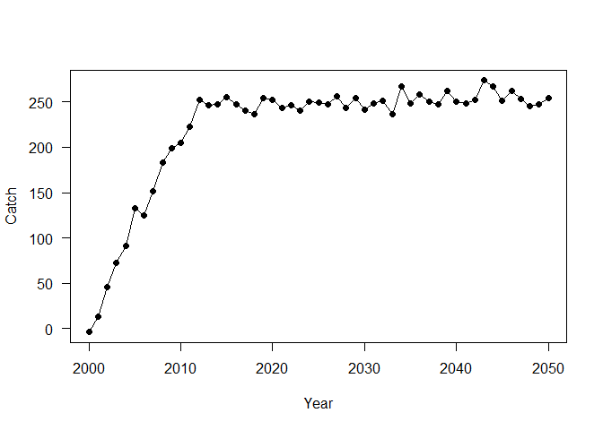
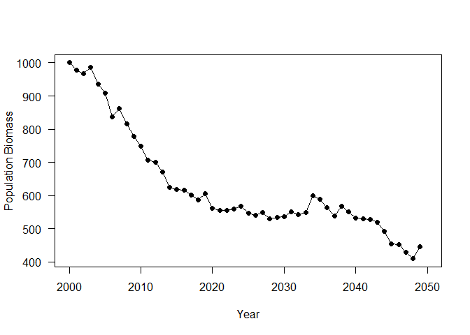
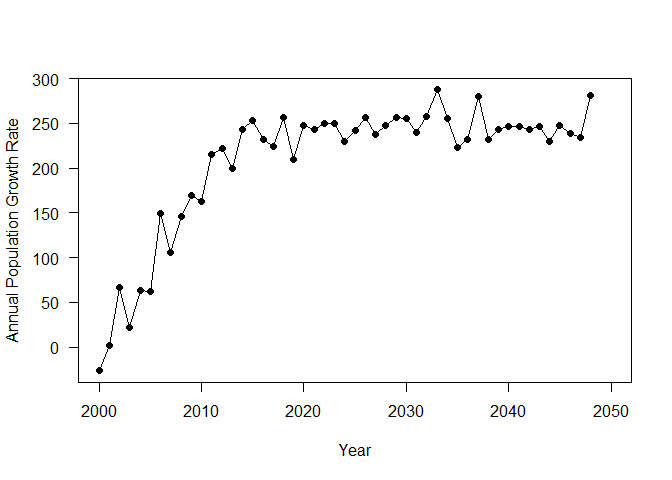

Surplus Production Model
================
Matt Robertson
March 2025

# Data Setup

I am going to make a ficticious fish population and track its dynamics
in response to an increasing and then stabilzing amount of fishing
pressure.

To do this, we first need to define the time over which we want to track
this population’s dynamics as well as some basic components of this
population’s biology.

I am going to run a simulation for 50 years, lets say from 2000 to 2050.

``` r
yrs<-seq(from=2000, to=2050)
nyears<-length(yrs)
```

When we imagine that a population grows following the dynamics modeled
with a surplus production model, we only need to understand the
population’s maximum growth rate, $r_{max}$, and its carrying capacity,
$K$.

We are going to start simply and expect that $r_{max} = 1$ and
$K = 1000$. Additionally, we are going to assume that our population is
at carrying capacity when our simulated fishery starts.

``` r
K<-1000

rmax<-1
```

# The fishery

For the purposes of this simulation, I am going to assume that the
fishery has followed a specific pattern of exploitation over time. In
this case, catches will start at 0 in 2000 and steadily increase to a
maximum value of 250 at which point it will level off and the fishery
will maintain at a steady amount of fishing pressure until the end of
the simulation.

``` r
effort<-rep(NA, nyears)
C<-rep(NA, nyears)
incF<-round(nyears*0.25,0)
effort[1:incF]<-seq(from=0, to=250, length=incF)
effort[(incF):nyears]<-250
for(i in 1:nyears){
C[i]<-effort[i] + rnorm(1, 0, 10)
}

plot(C~ yrs,pch=19, xlab="Year", ylab="Catch", las=1)
lines(C~ yrs)
```

<!-- -->

# Simulation

Now that the species biology and fishery have been defined, we can run a
theoretical simulation of how this fishery would impact this type of
population. I have include some random variability into the annual
fishing mortality and into the stock-recruitment relationship so no two
simulations should ever be the same. I have hidden the code, because the
details are not important for this class but we will look at how this
population changes over time.

After the simulation runs, we can examine how the population actually
changed over time. To start, we will look at total population biomass.

We can see that the fishery seems to reduce our population size steadily
at first but then the population stops declining and somewhat
stabilizes.

``` r
plot(B~yrs, pch=19, xlab="Year", ylab="Population Biomass", las=1)
lines(B~yrs)
```

<!-- -->

We can then see how the population growth rate changed as biomass
changed. When we do this, we see that the growth rate changes are almost
inverse of the population size, where we see a steady increase followed
by a plateau.

``` r
plot(pop_growth~yrs, pch=19, xlab="Year", ylab="Annual Population Growth Rate", las=1)
lines(pop_growth~yrs)
```

<!-- -->

If we compare how population growth has changed in relation to
population size, we will see a very familiar trend appear. The red line
indicates $B_{MSY}$, $K/2$, and the curve represents our expectations
for how population growth will change with biomass.

<!-- -->

We can also calculate what the catch at $MSY$ would be by using
$MSY = \frac{rK}{4}$. In this case, that is 250.

<!-- -->
